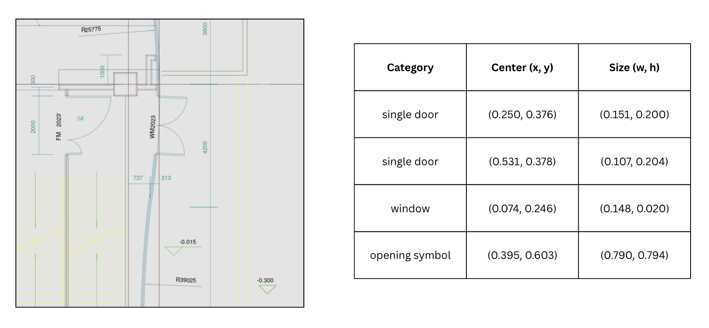
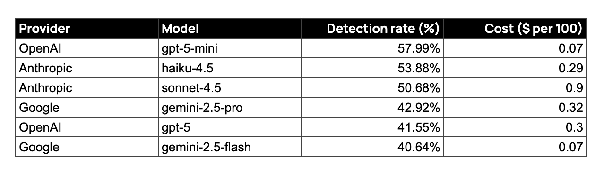
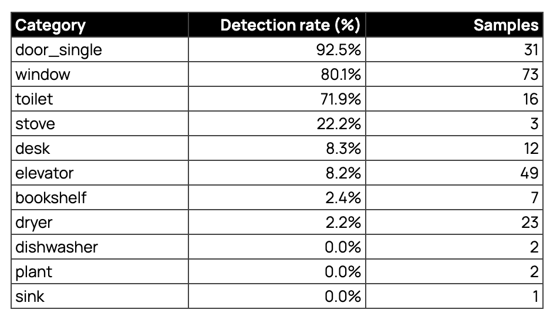
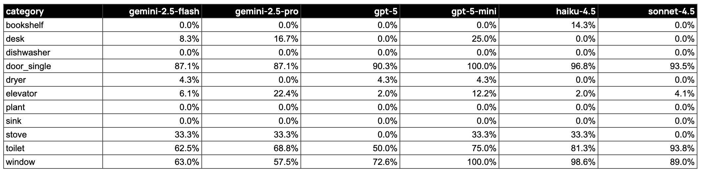

# How well can AI models detect drawings and symbols from floor plans?

## The Challenge

At AIDE, we build AI agents for the built world. For many workflows (e.g. takeoffs) in the build world, the abiltiy to floorplans, elevations, and CAD files is a critical requirement.

The challenge? These aren't photographs. They're technical drawings with standardized symbols and abstract representations. A door is an arc showing swing direction. A toilet is an oval. An elevator might just be a box labeled "E."

We like to run experiments to understand the capabilities and limits of current models. In this post, we're asking the following question: **Can today's vision AI reliably spot objects in architectural floorplans?**

This exercise is intentionally simple. We're using off-the-shelf models with a single prompt that's been optimised for the exercise. We're counting the number of objects an AI model can detect from a drawing.

## The Dataset: FloorPlanCAD

We used a YOLO-format version of the FloorPlanCAD dataset (Fan et al., ICCV 2021):

- **15,285 architectural floorplan images** (640×640 PNG format)
- **28 object categories** covering doors, windows, fixtures, appliances, and furniture
- **100 randomly selected samples** with annotations for testing

The original research used specialized computer vision models trained specifically on CAD drawings, achieving 70-90%+ detection rates. Those models learned architectural symbols through training. Our test is different. We're testing general-purpose vision models that have never seen CAD training data. Can they recognize technical drawings without specialized training?

The annotations are incomplete. Human annotators labeled only a subset of visible objects in each drawing (roughly 5-20% coverage). This affects all benchmarks using this data, including ours. We use these incomplete annotations as reference points for what objects definitely exist in each image.

### Example: What the Data Looks Like

This sample shows typical coverage. The floorplan contains many more objects than the 4 labeled - only a subset of doors, windows, and openings are annotated. This incomplete labeling means our detection rates represent lower bounds. A model might correctly identify unlabeled objects but get no credit in our metrics.

## What We're Testing

**The task**: Given a floorplan image, can the AI identify which architectural objects are present?

**The input**: A 640×640 pixel image of a CAD floorplan

**The prompt**: Detailed descriptions of CAD symbol conventions ("door_single: Arc showing door swing, single leaf")

**The output**: A list of detected categories with counts

**What we measure**: Detection rate. If the ground truth says "there's a toilet in this drawing," did the AI spot it? We're testing presence/absence, not precise location or exact counts.

This is pure visual recognition. The models look at an image and report what they see. We compare their answers to ground truth to measure how well they recognize architectural symbols.

## Models Tested

We benchmarked six frontier vision models:

- **Google**: Gemini 2.5 Flash, Gemini 2.5 Pro
- **Anthropic**: Claude Sonnet 4.5, Claude Haiku 4.5
- **OpenAI**: GPT-5, GPT-5-mini

## Results

GPT-5-mini led with 58% detection rate. Claude Haiku 4.5 came second at 54%. All models significantly underperformed specialized trained models (70-90%+), confirming the zero-shot challenge.

### Overall Performance (100 Samples)

**Key findings**:

- GPT-5-mini achieves best detection at lowest cost ($0.07 per 100 samples)
- Top three models (GPT-5-mini, Haiku 4.5, Sonnet 4.5) all exceed 50% detection
- All models show 20-40% lower detection than specialized trained models
- OpenAI and Anthropic models outperform Google Gemini on this task

### What AI Can and Can't Detect

Average detection rates across all models by category:

The results show a clear pattern. Models excel at large, high-contrast elements like doors and windows, achieving 80-93% detection. Distinctive fixtures like toilets reach 72% detection thanks to their recognizable oval shape. However, performance drops sharply for small objects, text-dependent elements, and uncommon fixtures, with most achieving less than 10% detection.

### Complete Category Results

Detection rates by category and model:

**Category patterns**:

1. **Large, high-contrast elements** (doors, windows) achieve 80-93% detection. These have clear visual features that translate from photographs.

2. **Distinctive fixtures** (toilets) reach 72% detection. The oval shape is recognizable even in abstract CAD form.

3. **Text-dependent objects** (elevators) fail at 8% detection. Labels like "E" require reading text, which these models struggle with in technical drawings.

4. **Small appliances and furniture** (dryers, desks, bookshelves) hit 2-8% detection. Abstract symbols and small scale make recognition difficult.

5. **Uncommon objects** (plants, sinks, dishwashers) achieve 0% detection. Either too rare in training data or too abstract in CAD representation.

## What This Means

**The bottom line**: General-purpose vision AI achieves 40-58% detection on CAD drawings without specialized training. Specialized models trained on architectural drawings hit 70-90%+. That 20-40 percentage point gap matters for production deployment.

**What works today**: AI can recognize large, high-contrast architectural elements (doors, windows) and distinctive fixtures (toilets) without training. For workflows where 50-60% coverage with human review is acceptable, current models can assist.

**What doesn't work**: Small objects, text-dependent labels, and uncommon fixtures are missed consistently. Automated takeoffs or code compliance needing 90%+ accuracy require either:

- Models trained specifically on architectural drawings
- Human-in-the-loop workflows
- Hybrid approaches combining AI suggestions with expert review

**The zero-shot gap**: Off-the-shelf vision models trained on natural images don't automatically understand technical drawings. CAD symbols are abstract and conventional. The 20-40% performance gap shows that construction AI needs domain-specific training or human augmentation for production use.

## Practical Takeaways

1. **Set realistic expectations**. Zero-shot models will miss 40-60% of objects in CAD drawings. Don't deploy for critical accuracy tasks without extensive validation.

2. **Choose the right model**. GPT-5-mini offers the best combination of accuracy (58%) and cost ($0.07 per 100 images). Haiku 4.5 provides strong performance (54%) at moderate cost ($0.29).

3. **Focus on what works**. If your use case centers on doors, windows, and major fixtures, current models can assist. For small appliances and text-labeled elements, plan for human review.

4. **Design for incomplete detection**. Build review interfaces and human verification into workflows. Assume the AI will miss 40-60% of objects.

5. **Test on your drawings**. Symbol conventions and drawing styles vary across firms. Our results from one dataset may not match your specific CAD standards.

6. **Consider training for production**. If you need 80-90% accuracy, follow the research approach: fine-tune models on your architectural drawings rather than relying on zero-shot recognition.

At AIDE, we're building AI agents for the built world. Our focus is on creating value for your business by ensuring accuracy and reliablilty. We're constantly pushing the boundaries of AI models to understand what works now vs. doesn't. If you're interested in exploring how AI agents can help your business, get in touch with our team [here](https://go.getaide.ai/demo).
